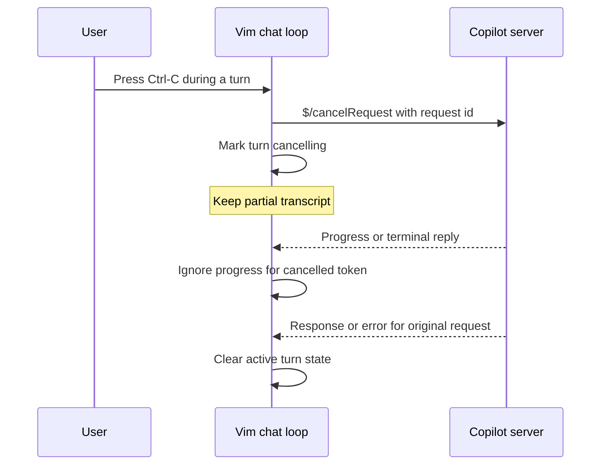

# Cancelling a Turn

**Implementation status: completed.** CTRL-C now sends `$/cancelRequest` for
the active request, filters late progress, waits up to five seconds for the
original response, and rejects an overlapping turn while it remains pending.
The mock server and focused test cover the matching cancellation request and
preservation of partial chat output.

## Overview

` :copilot chat` and `:copilot agent` run synchronously in
`copilot_turn_wait()` in `src/copilot.c`.  Pressing CTRL-C currently only
breaks Vim's local wait loop and prints `Copilot: chat interrupted`; the
outstanding `conversation/create` or `conversation/turn` request continues at
the language server because Vim never sends the LSP `$/cancelRequest`
notification.

Implement cancellation for the active chat/agent turn.  CTRL-C must send one
`$/cancelRequest` containing the original JSON-RPC request ID, leave already
streamed text in the chat transcript, discard later progress for that turn,
and prevent a new turn from reusing the conversation until the original
request has returned or failed.  No separate `:copilot cancel` subcommand is
planned: chat is synchronous, so an Ex command cannot be entered while the
current wait loop owns the UI.

The request ID is already retained in `cop_turn_id`; the existing
`cop_turn_token` identifies `$/progress` output.  Cancellation therefore does
not need a protocol or server-version change.

## Approach / Steps

1. Refactor the chat turn state in `src/copilot.c` so the active request ID,
   work-done token, busy state, and a new cancelling/cancelled flag have one
   explicit lifecycle.  Reset all of that state from the existing chat reset,
   stop, and error paths without removing an entry that is still in
   `cop_pending`.
2. Add a small cancellation helper next to `copilot_turn_wait()`.  When there
   is a live chat request, allocate params containing `id: cop_turn_id` and
   call `copilot_notify("$/cancelRequest", params)`.  Make it idempotent, so
   repeated interrupts or a later timeout emit at most one notification for a
   turn.  Retain the original request in `cop_pending`; only its normal
   response/error may finish it.
3. Change the CTRL-C branch in `copilot_turn_wait()` to invoke the helper,
   mark the turn cancelling, and continue processing the channel until the
   matching original request response/error has been received.  Use a short,
   separately tracked cancellation grace timeout rather than restarting the
   normal two-minute generation timeout.  If the server does not settle in
   that grace interval, report a cancellation-timeout error and keep the
   conversation unavailable until the pending request is resolved or the
   server is stopped.
4. Update `copilot_progress()` to leave the partial transcript intact but
   ignore `report` text and state changes associated with a cancelled token.
   Still consume messages through the channel parser, and let
   `copilot_turn_cb()` consume the request response/error and release the
   active-turn state.  Do not accept a second chat/agent request while that
   original request is pending, because overwriting `cop_turn_id` would make
   the eventual reply indistinguishable from a later turn.
5. Keep ordinary completion requests unchanged.  Their request IDs share the
   general JSON-RPC pending table but are not chat turns and must never cause
   `$/cancelRequest` from the chat interrupt path.
6. Extend `src/testdir/test_copilot_server.py` with a deterministic long-turn
   mode: emit an initial reply chunk, wait for a `$/cancelRequest` whose `id`
   matches the request, record it, then send extra progress and a terminal
   response.  The mock must continue reading framed requests while its turn is
   pending so the test validates the actual notification.
7. Add a Vim test in `src/testdir/test_copilot.vim` that starts the long turn,
   injects CTRL-C through the existing input/test helpers, and asserts that:
   the request ID received by the mock matches the turn request; the first
   chunk remains in `[Copilot Chat]`; late chunks are absent; the interrupted
   message is shown; and a subsequent chat request succeeds only after the
   cancelled request settles.  Add focused assertions for repeated CTRL-C and
   a server cancellation error if the mock can expose both cheaply.
8. Update `runtime/doc/copilot.txt`: describe CTRL-C cancellation in the chat
   section, state that partial text is retained, and document any new error
   code/message only if the implementation introduces one.  Bump the help
   file's `Last change:` header.  Remove the completed README TODO entry only
   in the implementation patch, not while this plan is pending.
9. Regenerate only the required prototypes with `make -C src proto` if a new
   non-static exported declaration requires it; otherwise leave generated
   prototype files untouched.  Run `make -C src/testdir test_copilot.res
   VIMPROG=../vim-copilot`, then build the touched configuration and inspect
   the focused diff for unrelated generated changes.

The standalone diagram is maintained in
`.ndx/plans/cancelling-a-turn.mmd` for Mermaid preview.

## Risks

- **Late output corrupts a later reply.** The server may emit progress after
   it receives cancellation.
   - **Mitigation:** Give the active turn an explicit `cancelling` state.  Keep
      its request ID and work-done token until the matching JSON-RPC response or
      error removes the request from `cop_pending`.  In `copilot_progress()`,
      match the token first and return before modifying the transcript whenever
      that turn is cancelling.  Allocate each next token from the existing
      monotonic sequence; never reuse or clear a cancelled token early.
   - **Verification:** Have the mock send one text chunk before cancellation and
      several chunks plus an `end` notification afterward.  Assert that the
      first chunk remains, every later chunk is absent, and the next completed
      turn is rendered under its own `## Copilot` heading.
- **A server never acknowledges cancellation.** `$/cancelRequest` is a
   notification, not an acknowledgement.
   - **Mitigation:** Start a distinct, short grace timer when cancellation is
      sent; do not reuse the normal generation deadline.  Continue pumping the
      channel so a normal response, cancellation error, or channel closure can
      release the request.  On expiry, report a dedicated cancellation-timeout
      message, retain the pending request state, reject a new chat/agent turn,
      and direct the user to the existing `:copilot stop` recovery path.  A
      stopped or closed channel must clear the active-turn state together with
      the pending table, as it does for other requests.
   - **Verification:** Add a mock mode that accepts the cancellation
      notification but deliberately withholds the response.  Use a short
      test-only timeout to assert the error, verify that a second turn is not
      sent, then run `:copilot stop` and confirm that starting a fresh
      conversation succeeds.
- **Conversation identity may arrive first in progress.** The current code
  obtains `conversationId` from both progress and the request result.  Preserve
   that behavior so a cancelled initial `conversation/create` can still be
   cleaned up or reused only when the server has safely settled it.
   - **Mitigation:** Continue recording a non-empty `conversationId` from
      `begin`/`report` progress even after the turn enters `cancelling`, while
      suppressing only transcript writes.  On a settled cancelled initial turn,
      preserve that ID only if the server returned it; otherwise leave it NULL
      so the next message creates a new conversation.  Do not send
      `conversation/destroy` without a confirmed ID.
   - **Verification:** Cover both mock orderings: progress supplies the ID
      before the cancelled response, and the response is the first source of the
      ID.  Assert that the subsequent request is respectively
      `conversation/turn` with that ID or a fresh `conversation/create`.
- **Tests can deadlock.** A mock that streams synchronously cannot receive the
   cancellation notification.
   - **Mitigation:** Make the mock long-turn behavior a small state machine:
      write its initial progress, read and validate framed input until the
      matching `$/cancelRequest` arrives, then send controlled late progress and
      a terminal response.  Use a bounded read/select timeout and emit a clear
      failure response when it expires.  Keep this mode opt-in so existing
      streaming tests retain their simple synchronous behavior.
   - **Verification:** Run the focused `test_copilot.res` target repeatedly
      under its normal test timeout.  The test must fail with the mock's explicit
      diagnostic rather than hang if Vim omits the cancellation notification or
      sends the wrong ID.
- **CTRL-C behavior regresses elsewhere.** Scope the change to the chat/agent
   wait loop.  Sign-in and inline completion use different waits and should
   retain their current interrupt behavior.
   - **Mitigation:** Put the cancellation helper behind the active chat-turn
      state and call it only from `copilot_turn_wait()`.  Do not change the
      generic channel dispatcher, sign-in wait, or inline-completion lifecycle.
      Preserve the current user-facing `Copilot: chat interrupted` message for
      an accepted CTRL-C, adding a distinct message only for cancellation
      timeout or send failure.
   - **Verification:** Retain the existing status, sign-in, streaming, second
      turn, inline completion, dismiss, and accept tests in the focused target.
      Add a narrow test that CTRL-C outside an active chat turn does not emit a
      cancellation notification; manually exercise sign-in interruption when a
      server test fixture can represent its device-flow wait.

## Timeline

1. **State and protocol work:** implement the active-turn cancellation state
   and channel-drain behavior in `src/copilot.c`.
2. **Regression coverage:** add the interruptible mock scenario and focused
   Vim tests, iterating until the cancellation notification and transcript
   assertions are deterministic.
3. **User-facing finish:** update help and README, regenerate prototypes only
   when necessary, then run the focused Copilot test target and a build.

## Priority

**P1.** This is an important usability and resource-control gap: a user can
interrupt Vim's wait today but cannot stop server-side generation.  It should
follow platform coverage and configuration work in the current README order,
but precede broader workflow enhancements such as completion-popup integration
and multi-file agent edits.