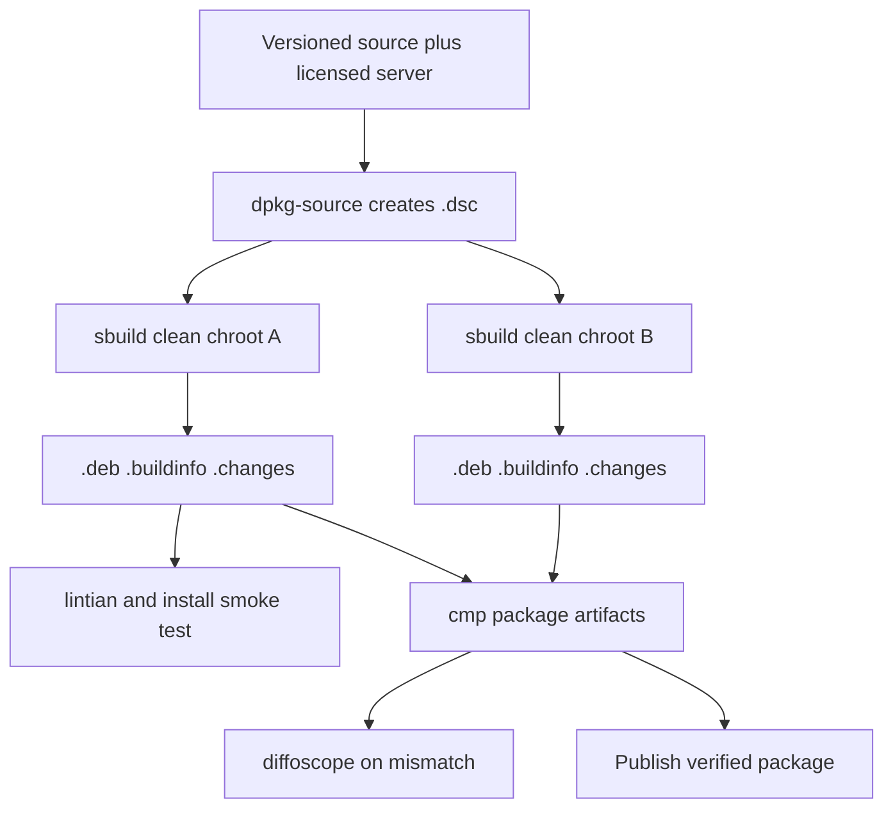

# Reproducible Packaging

## Overview

The current `make deb` path runs `debian-copilot/build-deb.sh` in the developer
checkout.  It reuses an already configured build tree, derives the maintainer
and distribution from the host, timestamps the installed changelog with
`date -R`, stages under `src/deb-root`, and invokes `dpkg-deb` directly.  It
therefore neither proves that build dependencies are declared nor produces the
Debian `.buildinfo` and `.changes` artifacts promised by a reproducible Debian
package workflow.

Replace that ad-hoc binary-package workflow with a conventional Debian source
package that `sbuild` can build in a fresh chroot.  The build must produce a
`.deb`, `.buildinfo`, and `.changes`; two builds of the same source package in
separate clean chroots with the same target suite and architecture must have
identical `.deb` contents.  The proprietary, licensed
`copilot-language-server` remains an explicit, locally supplied build input;
it must never be downloaded by the packaging rules or silently omitted.

This plan deliberately targets a supported Debian/Ubuntu suite and one
architecture at a time.  Cross-distribution, cross-architecture, and
bit-identical language-server binaries are separate release concerns.

**Implementation status: complete pending clean-chroot validation.** The
repository now has a native Debian source-package layout, deterministic build
rules, standard `.deb`/`.buildinfo`/`.changes` targets, an autopkgtest smoke
test, and a two-chroot comparison script.  Public source packages deliberately
omit the proprietary server, matching the existing copyright policy; an
approved internal build must inject it before creating the source package.
`dpkg-source --before-build` and rule dry-runs pass locally.  Running the full
build requires the declared `libacl1-dev` and `libgpm-dev` packages, while the
final two-chroot check requires a configured `sbuild` environment.

## Approach / Steps

1. Establish the Debian source-package layout under `debian/`, leaving
   `debian-copilot/` in place only until the new workflow has equivalent
   coverage.  Add `debian/control`, `debian/changelog`, `debian/copyright`,
   `debian/source/format`, `debian/rules`, and the file-install manifests or
   maintainer scripts required by the selected debhelper compatibility level.
   Make the source package generate a single `vim-copilot` binary package and
   retain the current coexistence contract: `/usr/bin/vim-copilot`, runtime
   data under `/usr/share/vim-copilot`, no `update-alternatives` registration,
   and no files shared with distribution Vim packages.
2. Make `debian/changelog` the canonical Debian version, distribution, date,
   and maintainer source.  Add a release procedure that updates it from the
   Vim version in `src/version.h` and `src/version.c`, rather than inspecting
   `/etc/os-release` or `$DEBEMAIL` during a build.  Use a Debian revision
   appropriate for the target suite (for example, `9.2.<patch>-1`) and reject
   a rules invocation whose changelog upstream version disagrees with the Vim
   sources.  This keeps package identity stable across build hosts.
3. Implement `debian/rules` with debhelper and an out-of-tree or freshly
   cleaned Vim build.  In `override_dh_auto_configure`, run `src/configure`
   with the existing `make deb-configure` options: `/usr` prefix, huge feature
   set, Copilot enabled, renamed Vim/Ex/View binaries, `vim-copilot` modified
   by string, and the existing hardened `DEB_CFLAGS`.  In the build and
   install overrides, use `make` and `make installvim DESTDIR=...` so `xxd`
   and desktop/icon files remain excluded.  Do not consume `src/auto/config.mk`
   or `src/deb-root` from a prior host build.
4. Declare every tool and library used by configure, compilation, install,
   dependency calculation, compression, and package assembly in
   `Build-Depends`.  Prefer `dh_shlibdeps`/`dpkg-shlibdeps` through debhelper
   to the script's `ldd` and `dpkg -S` fallback; allow normal `${shlibs:Depends}`
   substitution in `debian/control`.  Add explicit package dependencies for
   runtime requirements that cannot be inferred, preserving the current
   `ca-certificates`, `git`, and `vim` relationship only after validating it
   with `lintian` and an installation smoke test.
5. Define the licensed server handoff before source-package creation.  Provide
   a checked-in `debian/README.source` and a small, non-networked preparation
   command that copies a user-provided executable into a documented source
   package input path, preserves executable mode, and records its expected
   architecture.  Add that path to `debian/source/include-binaries` only when
   the release policy permits distributing the binary.  Otherwise make the
   source-package build fail early with a precise message, and define a
   separate internal source-artifact or repository mechanism; do not weaken
   the package by silently producing an unusable Copilot build.  Document the
   licensing and redistribution review required before either path is shipped.
6. Remove host-time and host-identity inputs from package payload generation.
   Export `SOURCE_DATE_EPOCH` from the timestamp of the top `debian/changelog`
   entry before configure, build, install, and compression.  Replace the
   handwritten changelog `date -R` output with the Debian-installed changelog.
   Ensure generated build-date data uses Vim's existing
   `src/configure.ac` support, gzip is invoked reproducibly, file enumeration
   is stable, and ownership, modes, locale, timezone, and umask are either
   normalized by debhelper/dpkg or explicitly controlled in rules.  Remove
   the custom `md5sums`, `Installed-Size`, and `dpkg-deb` assembly only after
   their debhelper equivalents have been verified.
7. Replace the public targets with clear roles: `make deb-src` prepares the
   source package; `make deb` invokes `dpkg-buildpackage -us -uc -b` for a
   fast local package build; and `make deb-sbuild` invokes `sbuild` with an
   explicitly supplied suite, architecture, and chroot configuration.  Keep
   the fast local target clearly marked as non-authoritative for clean-build
   verification.  Update `README.md` with prerequisites (`devscripts`,
   `debhelper`, `sbuild`, and a configured chroot), the licensed-server
   preparation step, artifact locations, and the clean-chroot command.
8. Add packaging checks that run without installing the result: verify source
   package contents with `dpkg-source --before-build`; run
   `dpkg-buildpackage -us -uc -b`; assert the `.deb`, `.buildinfo`, and
   `.changes` exist; run `lintian` on the generated changes file; and inspect
   package paths, ownership, dependencies, and the executable server mode.
   Add an isolated install-and-launch smoke test in a disposable chroot or
   container that confirms `vim-copilot --version` and the bundled server path
   work without files from the source checkout.
9. Add a reproducibility test script under `debian/tests/` or `ci/` that
   builds the identical `.dsc` twice in separately reset `sbuild` chroots,
   using the same suite, architecture, and build dependency snapshot.  Compare
   the resulting `.deb` files with `cmp` and use `diffoscope` on failure.
   Compare `.buildinfo` deliberately: permit only documented build-path or
   environment differences if Debian tooling includes them, then either
   eliminate those differences or record why the package payload remains
   reproducible.  Make this test an opt-in local target first, then promote it
   to CI once chroot provisioning and licensed-server access are available.
10. Retire `debian-copilot/build-deb.sh`, `src/deb-root`, and the old `make`
    targets only after the new local build, clean `sbuild` build, install
    smoke test, and two-build comparison succeed.  Update the README TODO to
    mark reproducible packaging complete only in that implementation change.

The standalone diagram is maintained in
`.ndx/plans/reproducible-packaging.mmd` for Mermaid preview.

## Risks

- **The proprietary server cannot legally enter a Debian source package.**
  Debian source packages must contain every binary build input visible to the
  clean chroot, but this repository does not include the server executable.
  - **Mitigation:** obtain licensing and redistribution approval before
    selecting `include-binaries`; otherwise use an approved private source
    artifact flow and keep the failure explicit.  Make the package build fail
    before compilation when the approved input is absent or wrong-architecture.
  - **Verification:** run the source-package preparation and an `sbuild` build
    with both a valid executable and a missing/wrong-architecture fixture.
- **A clean build changes the generated binary or dependency set.** Existing
  builds reuse a configured tree and infer dependencies from the host.
  - **Mitigation:** preserve the current configure flags in one `debian/rules`
    source of truth, declare dependencies, and compare `dpkg-deb --info` plus
    installed file lists against the current package during migration.
  - **Verification:** build once with the legacy path and once with the Debian
    rules on the same suite; check renamed binaries, runtime paths, dependencies,
    and a basic startup command.
- **Timestamps or ordering still leak into artifacts.** Archive member times,
  installed changelog timestamps, generated Vim build dates, locales, and file
  enumeration can each make two packages differ.
  - **Mitigation:** propagate `SOURCE_DATE_EPOCH`, use Debian-maintained
    changelog and debhelper paths, force a deterministic locale/timezone, and
    let `diffoscope` identify every remaining difference.
  - **Verification:** run the two-chroot test after changing rules, the bundled
    server, compression settings, or build dependencies.
- **`sbuild` infrastructure is unavailable to contributors or CI.** The local
  environment may have `dpkg-buildpackage` but no configured chroot.
  - **Mitigation:** retain a documented fast local build for iteration, make
    `deb-sbuild` report missing suite/chroot setup precisely, and keep clean
    verification mandatory for release and CI rather than every edit.
  - **Verification:** test the targets with and without a configured chroot;
    each failure must explain the setup action without modifying the host.
- **Maintaining both packaging paths drifts.** A long transition can make one
  path stale or publish divergent packages.
  - **Mitigation:** keep the overlap brief, compare outputs during migration,
    name one release path authoritative, and delete the legacy script in the
    same change that enables the verified path.
  - **Verification:** prevent release documentation and CI from invoking the
    legacy target once the Debian source-package path is accepted.

## Timeline

1. **Packaging foundation:** select the licensed-server distribution policy,
   add Debian source metadata, and make a local `dpkg-buildpackage` build.
2. **Determinism:** migrate timestamps and host-derived metadata, then compare
   two local source-package builds until payload differences are understood.
3. **Clean-room verification:** configure `sbuild`, declare/fix missing build
   dependencies, and add chroot installation and startup smoke checks.
4. **Automation and retirement:** add the two-chroot `cmp`/`diffoscope` check,
   integrate it with CI or release automation, update documentation, and remove
   the old packer.

## Priority

**P1.** This directly resolves a documented release-quality gap and establishes
trustworthy package provenance, but it depends on a licensing decision for the
bundled server and chroot infrastructure.  It should be completed before a
public Debian package release, while feature work can continue independently.