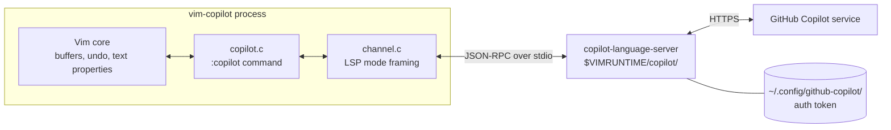
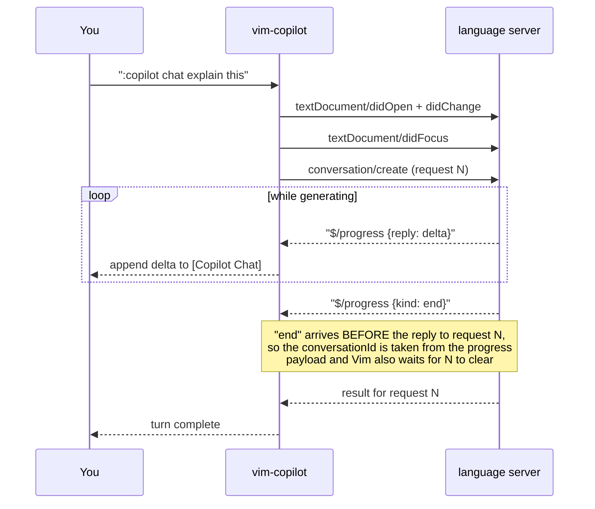
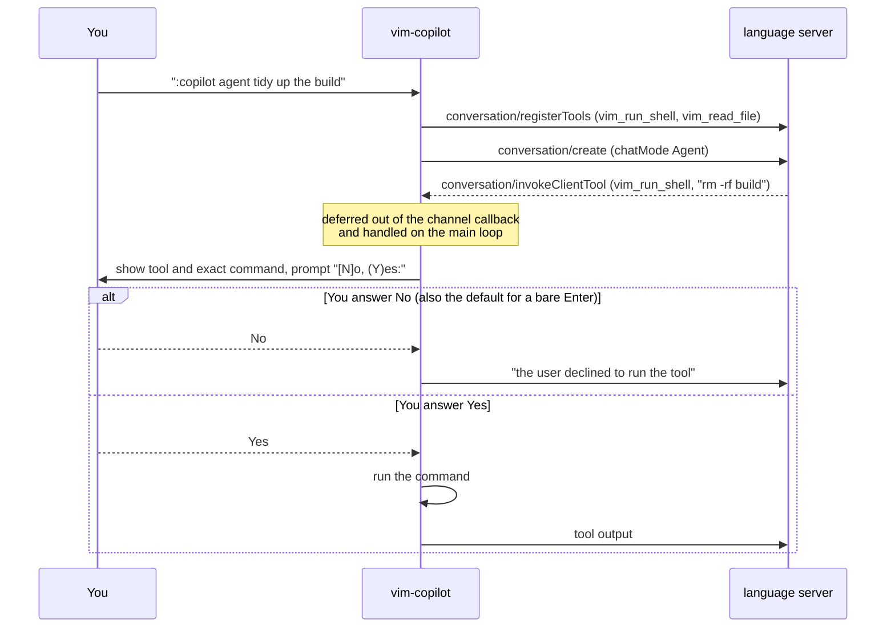
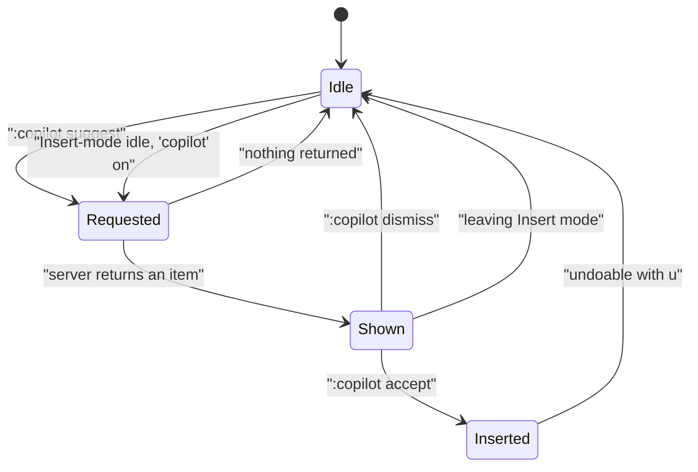

# vim-copilot

Vim 9.2 with GitHub Copilot built into the C core.

There is no plugin, no plugin manager, no VimScript shim and no Node.js
runtime. Vim starts the Copilot language server as a job and speaks LSP
JSON-RPC to it over a pipe, with framing handled by the existing channel
layer. Everything is driven by one command, `:copilot`, and two options.

The package installs as `vim-copilot` and keeps every file it owns under
`/usr/share/vim-copilot`, so it can be installed next to your distribution's
own `vim` without sharing, replacing or shadowing a single file.

```
$ vim-copilot --version | head -3
VIM - Vi IMproved 9.2 (2026 Feb 14, compiled Aug 22 2026 06:23:45)
Included patches: 1-993
Modified by vim-copilot
```

---

## Contents

- [How it works](#how-it-works)
- [Install](#install)
- [Setup](#setup)
- [Configure](#configure)
- [Usage](#usage)
- [Security](#security)
- [Errors](#errors)
- [Building from source](#building-from-source)
- [TODO](#todo)
- [Upstream Vim](#upstream-vim)

---

## How it works



Vim never handles your Copilot token; the language server stores it. The
server is spawned lazily, on the first command that needs it.

The messages Vim exchanges with the server:

| Direction | Message | When |
| --- | --- | --- |
| to server | `initialize` | server start |
| to server | `checkStatus` | `:copilot status` |
| to server | `signInInitiate`, `signInConfirm` | `:copilot signin` |
| to server | `textDocument/didOpen`, `didChange`, `didClose` | buffer sync |
| to server | `conversation/create`, `conversation/turn` | chat and slash commands |
| to server | `conversation/registerTools` | agent mode |
| to server | `textDocument/inlineCompletion` | inline suggestions |
| from server | `$/progress` | streamed reply deltas |
| from server | `window/showDocument` | sign-in URL |
| from server | `conversation/invokeClientTool` | agent wants to run a tool |

### A chat turn

Replies arrive as `$/progress` deltas that are appended to the transcript as
they stream in.



### An agent tool call



### Inline suggestion lifecycle



---

## Install

### From the Debian package

```sh
sudo dpkg -i vim-copilot_9.2.993+noble_amd64.deb
sudo apt-get -f install        # only if dependencies are missing
```

Dependencies are `libc6`, `libtinfo6`, `libstdc++6` and `libgcc-s1`, all
already present on a standard Debian or Ubuntu system.

The package name records the distribution it was built on, because the glibc
and ncurses sonames it links against are not portable across releases. Build
your own with `make deb` if you run something else.

### What gets installed

```
/usr/bin/vim-copilot                       the editor
/usr/bin/{ex,view,rvim,rview}-copilot      symlinks, as for stock Vim
/usr/bin/vim-copilotdiff                   symlink
/usr/bin/vim-copilottutor                  tutor script
/usr/share/vim-copilot/vim92/              runtime files
/usr/share/vim-copilot/vim92/copilot/      bundled language server
/usr/share/man/man1/vim-copilot*.1         manual pages
/usr/share/doc/vim-copilot/                copyright, changelog, this README
```

### Coexistence with the system Vim

The package deliberately does **not**:

- install anything named `vim`, `vi`, `ex`, `view`, `xxd`, `vimdiff` or
  `vimtutor`
- write to `/usr/share/vim`, which belongs to `vim-runtime`
- install `vim.desktop`, `gvim.desktop` or `gvim.png`, which belong to
  `vim-common` and `vim-gui-common`
- register anything with `update-alternatives`

so it declares no `Conflicts` and no `Replaces`. Your `vim` keeps working
exactly as before, and `update-alternatives --display vim` is untouched.

Verify it yourself:

```sh
# no packaged path is owned by another package; this should print nothing
dpkg -c vim-copilot_*.deb | awk '{print $6}' | sed 's|^\.||' \
  | while read -r p; do dpkg -S "$p" 2>/dev/null; done

# both editors work, with separate runtimes
vim --version         | head -2
vim-copilot --version | head -2
update-alternatives --display vim
```

To remove it:

```sh
sudo dpkg -r vim-copilot
```

---

## Setup

Check the feature is compiled in:

```vim
:echo has('copilot')
```

Sign in using the GitHub device flow. Vim prints a URL and a one-time code;
open the URL, enter the code, and Vim reports when authorisation completes.
Press `CTRL-C` to give up.

```vim
:copilot signin
```

Confirm it worked:

```vim
:copilot status
" Copilot: OK (signed in as your-username)
```

The token is stored by the language server under `~/.config/github-copilot/`,
not by Vim. `:copilot signout` removes it.

A GitHub Copilot subscription is required.

---

## Configure

Two global options, both settable from your `vimrc`.

### `'copilot'` (`'cop'`) — boolean, default `off`

When on, suggestions are requested automatically whenever Vim goes idle in
Insert mode.

```vim
set copilot
```

The server is started on the first suggestion rather than when the option is
set, so putting this in a `vimrc` does not slow down startup.

### `'copilotcommand'` (`'cpcmd'`) — string, default `""`

Path of the `copilot-language-server` executable. When empty, the binary
shipped with Vim is used, that is
`$VIMRUNTIME/copilot/copilot-language-server`.

```vim
set copilotcommand=/opt/copilot/copilot-language-server
```

This option cannot be set from a modeline or in the sandbox.

### A sample vimrc

```vim
" suggestions as you type
set copilot

" accept or dismiss the suggestion being shown
inoremap <silent> <C-J> <Cmd>copilot accept<CR>
inoremap <silent> <C-]> <Cmd>copilot dismiss<CR>

" ask about the visual selection
xnoremap <leader>ce :copilot explain<CR>
xnoremap <leader>cf :copilot fix<CR>
```

---

## Usage

Every subcommand has command-line completion.

### Chat

| Command | Description |
| --- | --- |
| `:copilot chat {message}` | Send `{message}` and stream the answer into the `[Copilot Chat]` window. Later messages continue the same conversation. |
| `:copilot reset` | Throw away the conversation and start a new one. |

The transcript uses the `copilotchat` filetype, so headings and fenced code
blocks are highlighted. It is an ordinary scratch buffer: search and yank in
it as usual.

### Working on code

These take a range, by default the whole buffer. Use them from Visual mode to
ask about a selection.

| Command | Description |
| --- | --- |
| `:[range]copilot explain` | Explain what the code does. |
| `:[range]copilot fix` | Point out problems and suggest fixes. |
| `:[range]copilot tests` | Write tests for the code. |
| `:[range]copilot doc` | Write documentation for the code. |
| `:[range]copilot simplify` | Suggest a simpler version. |
| `:copilot apply` | Replace the range the last command above ran on with the fenced code block under the cursor. |

```vim
:'<,'>copilot fix
" then, in the chat window, with the cursor in the code block:
:copilot apply
```

`:copilot apply` changes the buffer and can be undone with `u`.

### Inline completions

| Command | Description |
| --- | --- |
| `:copilot suggest` | Ask for a completion at the cursor, shown as grey virtual text. Only the not-yet-typed part is shown. |
| `:copilot accept` | Insert the suggestion being shown. Undoable with `u`. |
| `:copilot dismiss` | Remove the suggestion without inserting it. |

With `'copilot'` on, suggestions are requested automatically once Vim has been
idle for a moment in Insert mode, and dropped again when you leave Insert mode
or move on. Only one request is in flight at a time. Indentation follows
`'expandtab'` and `'shiftwidth'`.

### Agent mode

| Command | Description |
| --- | --- |
| `:copilot agent {message}` | Like `:copilot chat`, but Copilot may ask Vim to run tools on your machine. |

See [Security](#security) below. `:copilot chat` switches back out of agent
mode.

### Server and session

| Command | Description |
| --- | --- |
| `:copilot` or `:copilot status` | Report whether the server is running and who is signed in. |
| `:copilot version` | Show the language server path and version. |
| `:copilot start` | Start the server. |
| `:copilot stop` | Stop the server and forget the conversation. |
| `:copilot restart` | Stop and start again. |
| `:copilot signin` | Sign in with the device flow. |
| `:copilot signout` | Sign out. |
| `:copilot debug` | Show how the current buffer looks to the server: URI, filetype, and cursor position in UTF-16 units. For diagnosis. |

---

## Security

**Your code is sent to the GitHub Copilot service.** Do not use this on
material you are not allowed to share. Buffers are synced to the server as you
edit them, and `vim_read_file` sends a file's contents.

Vim has no telemetry setting and does not send a telemetry preference to the
language server. Telemetry policy and any settings are controlled by the
language server and the service. Use `:copilot version` to identify the server
version when consulting its documentation.

Agent tools run on your machine, with your privileges. Before any tool runs,
Vim shows exactly what was asked for and waits:

```
Copilot wants to run a tool.

Tool: vim_run_shell
Command: rm -rf build
This runs on your machine with your privileges.
Allow?
[N]o, (Y)es:
```

- The answer **defaults to No**, so a stray `<CR>` is always safe.
- Consent is asked for **every single call**. There is deliberately no way to
  approve a tool once and for all, and no allow list.
- Vim asks **even when the server does not request confirmation**. The
  protocol permits the server to invoke a client tool directly, with no
  confirmation round-trip, and it does so in practice. Consent is therefore
  enforced entirely on the client side and never delegated to the server.

Read the command before allowing it: it is chosen by a language model, and it
runs as you.

`'copilotcommand'` is a secure option and cannot be set from a modeline or in
the sandbox, so opening a hostile file cannot redirect Vim to a different
server binary.

---

## Errors

| Code | Meaning |
| --- | --- |
| `E1600` | The language server could not be started. Check `'copilotcommand'`. |
| `E1601` | The language server did not answer in time. |
| `E1602` | Sign in failed. |
| `E1603` | Sign in timed out. |
| `E1604` | The buffer has no file name, so it cannot be sent to the server. |
| `E1605` | Chat failed. |
| `E1606` | `:copilot apply` was used outside the chat window. |
| `E1607` | There is nothing to replace. |
| `E1608` | The cursor is not in a fenced code block. |
| `E1609` | There is no suggestion to accept. |

`:help copilot` has the full reference. `:copilot debug` and
`:call ch_logfile('/tmp/ch.log', 'w')` are the diagnosis tools.

---

## Building from source

### The Debian package

**Completed:** Debian packages now build from a source package with fixed
timestamps and can be verified in two clean `sbuild` chroots.

On Debian or Ubuntu, install the build tools and declared dependencies first:

```sh
sudo apt update
sudo apt install build-essential debhelper devscripts diffoscope dpkg-dev \
  libacl1-dev libgpm-dev libncurses-dev libtool-bin pkg-config sbuild
```

The proprietary language server is not included in the public source package.
After installation, configure `'copilotcommand'` to point to an executable you
obtained separately.  An approved internal build may bundle a licensed,
architecture-matched executable at `runtime/copilot/copilot-language-server`
before creating the source package; see [debian/README.source](debian/README.source).

```sh
make deb-src       # creates .dsc and source tarball artifacts
make deb           # creates .deb, .buildinfo and .changes artifacts
```

The artifacts are written to the parent directory of the source checkout.
`debian/changelog` is the authoritative package version, maintainer and build
timestamp.  `debian/rules` exports that timestamp as `SOURCE_DATE_EPOCH` for
configure, compilation, installation and package assembly.

For a release build, configure an `sbuild` chroot for the target suite, then
build the same source package twice in fresh chroots:

```sh
make deb-sbuild DEB_SUITE=unstable DEB_ARCH=amd64
```

The verification compares the resulting `.deb` files byte-for-byte and runs
`diffoscope` when they differ.  `make deb` is useful for local iteration but
is not a clean-chroot reproducibility check.

Verify the resulting package before installing it:

```sh
dpkg-deb --info ../vim-copilot_*.deb
dpkg-deb --contents ../vim-copilot_*.deb \
  | grep '/usr/bin/vim-copilot\|copilot-language-server'
```

Use `lintian ../vim-copilot_*.changes` to inspect the package metadata.  The
package build uses `dh_shlibdeps` to calculate shared-library dependencies.

`make deb-clean` removes the Debian build tree and helper files.  Remove the
artifacts in the parent directory separately when they are no longer needed.

### A plain build

```sh
cd src
./configure --with-features=huge --enable-copilot \
            --with-vim-name=vim-copilot \
            --with-ex-name=ex-copilot \
            --with-view-name=view-copilot
make
```

`--enable-copilot` defaults to `auto`, which enables the feature whenever
`+job` and `+popup` are available, as they are in a `huge` build. `+copilot`
appears in `:version` when it is on.

The bundled server lives in `runtime/copilot/` and is installed by the
`installcopilot` target, which `installruntime` pulls in.

### Tests

```sh
cd src/testdir
make test_copilot.res VIMPROG=../vim-copilot
```

The 17 tests drive `test_copilot_server.py`, a mock LSP server, so they need
no network access and no GitHub account. An empty `test_copilot.res` means
everything passed.

---

## TODO

Not implemented yet, roughly in order of how much they are missed:

- **GUI support.** The build is terminal-only. Ghost text and the chat window
  have never been exercised under gvim.
- **Other platforms.** Only a linux-x64 server binary is bundled. macOS,
  arm64 and Windows need their own, supplied via `'copilotcommand'`.
- **Enterprise and proxy configuration.** No way to point at a GitHub
  Enterprise endpoint or an HTTP proxy from Vim.
- **Completion popup integration.** Suggestions are virtual text only and do
  not participate in `ins-completion`.
- **Multi-file agent edits.** Tools can read files and run commands, but the
  agent cannot propose edits across several buffers.
- **Workspace context.** Only the current buffer is sent; there is no
  workspace indexing, so Copilot cannot see the rest of the project.
- **Default mappings.** Accepting a suggestion needs a mapping you write
  yourself; there is no `<Tab>` handling out of the box.
- **Telemetry controls.** No surface for the server's telemetry settings.

---

## Upstream Vim

This is a fork of [Vim](https://www.vim.org). Everything except the Copilot
feature is the work of Bram Moolenaar and the Vim contributors, and is
unchanged. The original README is kept as [README.txt](README.txt).

Vim is Charityware. You can use and copy it as much as you like, but you are
encouraged to make a donation for needy children in Uganda: see
`:help uganda`, or [runtime/doc/uganda.txt](runtime/doc/uganda.txt).

The bundled `copilot-language-server` is **proprietary software from GitHub,
Inc.** It is not covered by the Vim license and requires a GitHub Copilot
subscription. See [debian-copilot/copyright](debian-copilot/copyright).

- Vim documentation: `:help`, or [runtime/doc/](runtime/doc/)
- Copilot feature reference: `:help copilot`, or
  [runtime/doc/copilot.txt](runtime/doc/copilot.txt)
- Upstream repository: https://github.com/vim/vim
